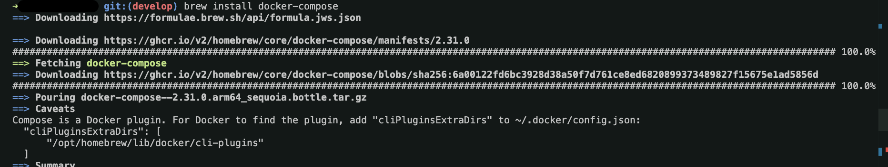
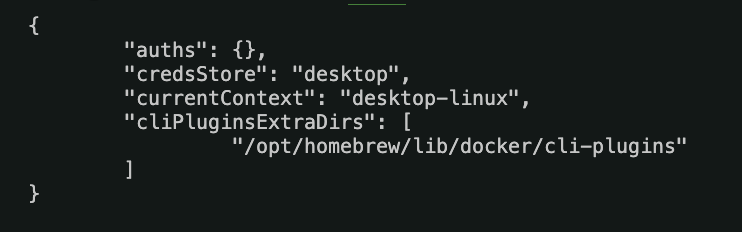

## Docker install

```bash
brew install --cask docker
```

```bash
brew install docker-compose
```



```bash
# 디렉토리가 없다면 생성
mkdir -p ~/.docker

# config.json 파일 생성/수정
vi ~/.docker/config.json
```

기존 내용이 있다면 그 아래에 추가해 넣습니다.



```bash
# 설치가 잘됐는지 확인
docker -v

docker-compose -v
```
